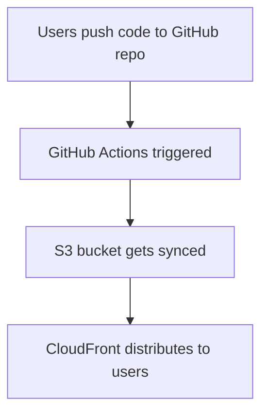

# Follow the steps to work on the project



1. Create a Github repo
2. Create a s3 bucket in AWS account
   ```
    aws s3 mb s3://githubaction-bucket-141

   ```
3. Create a cloudfront distribution and select s3 bucket as the origin
   ```
    aws cloudfront create-distribution \
    --origin-domain-name <bucket-name>.s3.amazonaws.com \
    --default-root-object index.html

   ```
- Create OAC to restrict access to s3 resources
4. Create an index.html file in the github repo that will be used by distribution
5. Authenticate github to AWS using OIDC provider.
6. Go to AWS console and create a new identity
7. Setup Github actions
   - Create a file in ./.github/workflows/ directory with the following name `deploy.yaml`
   - Use the following content
   
```
name: AWS S3 workflow
on:
  push
env:
  BUCKET_NAME : "<bucketname>"
  AWS_REGION : "ap-south-1"
permissions:
  id-token: write  
  contents: read   
jobs:
  S3PackageUpload:
    runs-on: ubuntu-latest
    steps:
      - name: Git clone the repository
        uses: actions/checkout@v4
    #  - name: Set up Node.js
    #    uses: actions/setup-node@v3
    #    with:
     #     node-version: '16' # Replace with the Node.js version used in your project

 #     - name: Install dependencies
     #   run: npm install

    # - name: Build the project
     #   run: npm run build
      - name: configure aws credentials
        uses: aws-actions/configure-aws-credentials@e3dd6a429d7300a6a4c196c26e071d42e0343502
        with:
          role-to-assume: <role_arn>
          role-session-name: samplerolesession
          aws-region: ${{ env.AWS_REGION }}
      - name: Sync s3 bucket
        run: |
          aws s3 sync . s3://${{ env.BUCKET_NAME }}
          aws cloudfront create-invalidation --distribution-id <distribution_id> --paths '/*' 
```
